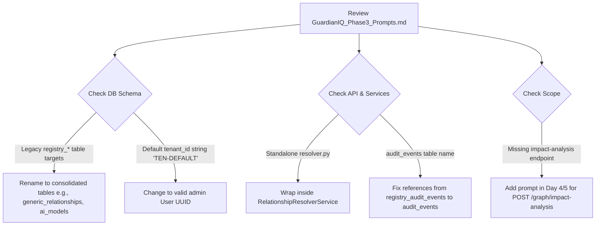

# GuardianIQ Phase 3 Prompt Alignment & Gap Assessment Report

This report evaluates the alignment between the **Phase 3 Prompt Pack** (`GuardianIQ_Phase3_Prompts.md`) and the **Phase 3 official documentation** located in `docs/Phase 3/` (comprising `Phase3-Architecture-EAguide.pdf`, `Phase3-Volume2A_UX_Foundation_Information_Architecture.pdf`, and `Phase3Plan-GuardianIQ.xlsx`). 

---

## Executive Summary

There is a **partial alignment** in the logical progression of day-wise tasks between the Prompt Pack and the Excel Sprint Plan. However, there are **critical architectural and database-level mismatches** that will cause execution failures, database crashes, and duplicate components if the prompts are run as written.

### Alignment Verdict: 🔴 **CRITICAL MISALIGNMENTS IDENTIFIED**

To ensure a successful sprint execution, the prompts in `GuardianIQ_Phase3_Prompts.md` must be modified before distribution to coding agents.

---

## 1. Critical Database Mismatches (Blockers)

### 1.1 Legacy `registry_*` vs. Consolidated operational tables
*   **The Issue:** The Prompt Pack (specifically Prompts **1.3, 1.4, 2.1, 2.2, 2.3, and 2.4**) assumes the database structure contains legacy tables prefixed with `registry_` (e.g., `registry_relationships`, `registry_ai_models`, `registry_ai_agents`). It instructs the agent to add `tenant_id` to these legacy tables and to *extend `registry_relationships` in-place*.
*   **The Reality:** The actual database (implemented in SQLAlchemy and deployed in PostgreSQL via migration version `7e72dc221571_phase3_schema_consolidation.py`) has **already consolidated** these tables. The legacy `registry_*` tables have been dropped, and the new consolidated operational tables (`ai_models`, `agents`, `tools`, `workflows`, and `generic_relationships`) are the single source of truth.
*   **The Impact:** Coding agents running Day 2 prompts will fail when executing Alembic migrations, as they will attempt to run DDL operations on non-existent `registry_relationships` and `registry_ai_models` tables.

### 1.2 Invalid `tenant_id` format and Foreign Key constraint check
*   **The Issue:** Prompt **2.1** instructs the agent to backfill `tenant_id` with a default value of `"TEN-DEFAULT"`, and the Database Migration Plan mentions `"TEN_INNOVANT"`.
*   **The Reality:** In the database mixin (`app/shared/mixins.py`), the `tenant_id` column is defined as `UUID(as_uuid=True)` with a foreign key constraint pointing to `users.id`:
    ```python
    tenant_id = Column(UUID(as_uuid=True), ForeignKey("users.id"), nullable=False)
    ```
*   **The Impact:** 
    1.  `"TEN-DEFAULT"` and `"TEN_INNOVANT"` are short strings, which will trigger syntax errors in PostgreSQL since they are not valid UUIDs.
    2.  Even if formatted as UUIDs, they will trigger a **foreign key constraint violation** because no user with those IDs exists in the `users` table. The `tenant_id` must be a valid, existing user's UUID (such as the admin user's UUID).

---

## 2. API Endpoint & Class Naming Misalignments

### 2.1 Route Prefix Mismatch (`/api/v1` vs. `/api/registry`)
*   **The Issue:** The EA Guide (Section O) and the Excel Mapping Guide list the new Phase 3 endpoints under `/api/v1/...` (e.g., `POST /api/v1/relationships`, `GET /api/v1/graph/{type}/{id}`).
*   **The Reality:** The existing API routing structure in the backend (found in `backend/app/modules/registry/routes.py`) exposes relationships under `/api/registry/...` (e.g., `/api/registry/relationships`).
*   **The Impact:** Front-end calls will encounter `404 Not Found` errors if they target `/api/v1` routes unless the backend implements a separate API router group for `/api/v1/`.

### 2.2 Backend Service Naming Mismatches
The Prompt Pack defines standalone module functions, whereas the Mapping Guide expects structured services:

| Concept / Flow | Prompt Pack Target (`GuardianIQ_Phase3_Prompts.md`) | Mapping Guide Target (`Phase3Plan-GuardianIQ.xlsx`) |
| :--- | :--- | :--- |
| **Relationship Validation** | `app/modules/relationship/validators.py` (`validate_relationship_payload`) | `ValidationEngine.validate_payload` |
| **Governance Context** | `app/modules/relationship/resolver.py` (`resolve_governance_context`) | `RelationshipResolverService.resolve_governance_context` |
| **Graph Traversal** | `app/modules/relationship/graph_builder.py` (`build_graph`) | `GraphService.build_graph` |
| **Audit Trails & Timeline** | `GovernanceEventService` / `registry_audit_events` | `RelationshipAuditService.get_timeline` / `audit_events` |

---

## 3. Deferred / Missing Functional Scope

### 3.1 Impact Analysis API & Logic
*   **The Issue:** The Excel Mapping Guide (row 8) defines a requirement for **Impact Analysis** targeting the endpoint `POST /api/v1/graph/impact-analysis` using backend service `GraphService.impact_analysis` and audit event `IMPACT_ANALYSIS_PERFORMED`.
*   **The Reality:** The Prompt Pack only mentions `relationship_graph_snapshots` stubs, but **completely omits** implementing the actual service logic, tests, or API routes for the Impact Analysis requirement. Day 5 and Day 6 prompts do not verify this flow.

---

## 4. Frontend Layout and Component Misalignments

### 4.1 Nested Directory Structure vs. Flat Page Structure
*   **The Issue:** Section 14 of the UX Foundation PDF and Prompt **1.6** suggest creating subfolders for pages under `src/pages/relationships/` (e.g., `src/pages/relationships/RelationshipExplorer.tsx`).
*   **The Reality:** The existing frontend project structure keeps pages flat in `src/pages/` (e.g., `src/pages/RegistryRelationshipsPage.tsx` and `src/pages/RegistryAgentsPage.tsx`).
*   **The Impact:** Creating nested directories for new relationship views will duplicate files and deviate from the established project layout, causing compilation warnings or broken routing links in `AppRouter.tsx`.

---

## 5. Summary of Recommended Prompt Adjustments

To align the Prompt Pack with the actual codebase and prevent execution errors, apply the following adjustments:



### Day-by-Day Correction Guide:

*   **Day 1 (Prompt 1.3 & 1.4):** Change references from `registry_relationships` to `generic_relationships`, and use the consolidated table names (`ai_models`, `agents`, etc.). Update the schema designs to match the mixins in `app/shared/mixins.py`.
*   **Day 2 (Prompt 2.1):** 
    1.  Remove commands to alter `registry_*` tables. Instead, target the consolidated tables.
    2.  Replace the default tenant value `"TEN-DEFAULT"` with a python-retrieved active administrator UUID (e.g., `admin_user.id`) to avoid foreign key and UUID type constraint failures.
*   **Day 3 (Prompt 3.3 & 3.4):**
    1.  Wrap the validation functions inside a `ValidationEngine` class.
    2.  Change references from `registry_audit_events` to the actual `audit_events` table, and use the existing `GovernanceEventService` class.
*   **Day 4 (Prompt 4.1 & 4.3):**
    1.  Add route definitions and service logic for `POST /api/v1/graph/impact-analysis` (`GraphService.impact_analysis`).
    2.  Wrap resolver functions in `RelationshipResolverService`.
    3.  Define the API endpoints under the existing `/api/registry/...` prefix or configure `/api/v1/...` routes in `backend/app/main.py`.
*   **Day 5 (Prompt 5.2):** Update the timeline view to call the actual endpoint `GET /api/registry/audit/...` or the corresponding backend service instead of the stubbed resolver.
