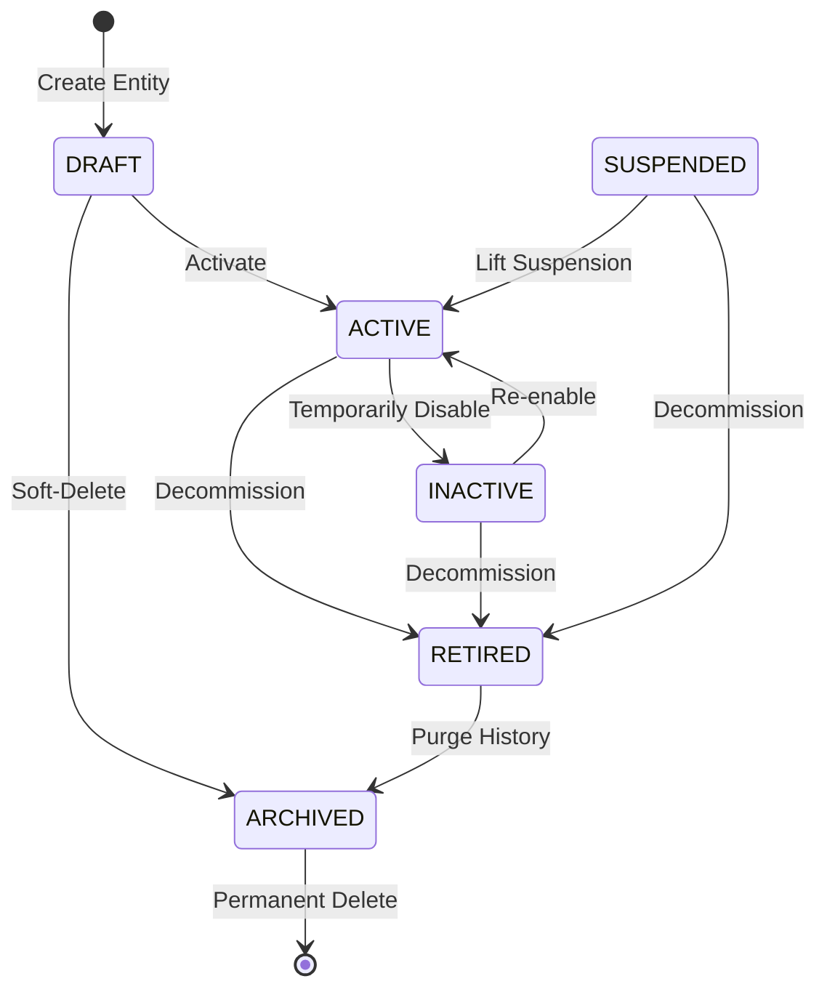
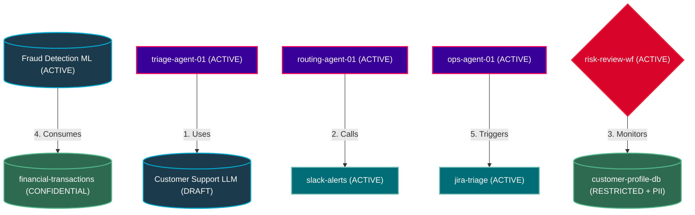

# GuardianIQ Registry API — Phase 1 Technical Documentation
*Single Source of Truth for AI Governance, Models, Agents, Tools, and Workflows.*

---

## 📖 Table of Contents
1. [Overview](#-overview)
2. [Task A: Consistency Audit (Pagination, Filters & Meta)](#-task-a-consistency-audit-pagination-filters--meta)
   - [Unified Query Parameters](#unified-query-parameters)
   - [Entity-Specific Filters](#entity-specific-filters)
   - [Standardized Response Metadata](#standardized-response-metadata)
3. [Task B: QA Cycle 1 Defects & Error Handling](#-task-b-qa-cycle-1-defects--error-handling)
   - [Duplicate Code Validation (409 Conflict)](#1-duplicate-code-validation-409-conflict)
   - [Validation Error Format (422 Unprocessable Entity)](#2-validation-error-format-422-unprocessable-entity)
   - [Invalid Status Transitions (400 Bad Request)](#3-invalid-status-transitions-400-bad-request)
   - [Role-Based Access Violations (403 Forbidden)](#4-role-based-access-violations-403-forbidden)
   - [Missing Required Fields (422 Unprocessable Entity)](#5-missing-required-fields-422-unprocessable-entity)
4. [Task C: Swagger & OpenAPI Enhancements](#-task-c-swagger--openapi-enhancements)
   - [FastAPI Application Definition](#fastapi-application-definition)
   - [Endpoint Tag Grouping & Descriptions](#endpoint-tag-grouping--descriptions)
   - [Pydantic Response Schemas & OpenAPI Examples](#pydantic-response-schemas--openapi-examples)
5. [Task D: Idempotent Demo Data Seeding](#-task-d-idempotent-demo-data-seeding)
   - [Seed Specification Details](#seed-specification-details)
   - [Entity Relationships Diagram](#entity-relationships-diagram)
   - [Running the Seeding Script](#running-the-seeding-script)
6. [Verification & Testing Guide](#-verification--testing-guide)

---

## 🔍 Overview
GuardianIQ Registry API (Phase 1) establishes a highly secure, audited, and standardized governance registry for AI Models, Autonomous Agents, Integration Tools, Security Workflows, and Data Sources. This documentation serves as a complete reference for the API's pagination standards, error response models, swagger specs, and realistic demo data structures.

> [!NOTE]
> All registry endpoints are fully integrated with centralized middleware (`RequestIDMiddleware`, `ResponseStandardizationMiddleware`, `LoggingMiddleware`) to guarantee traceablity (via `X-Request-ID` headers) and consistent JSON envelopes.

---

## 📊 Task A: Consistency Audit (Pagination, Filters & Meta)
To prevent API drift, every collection list endpoint (`GET`) implements a standardized pagination, sorting, and filtering interface.

### Unified Query Parameters
Every list route expects the following parameters:

| Parameter | Type | Default | Constraints | Description |
| :--- | :--- | :--- | :--- | :--- |
| `page` | `int` | `1` | `min=1` | The target page number. |
| `page_size` | `int` | `20` | `min=1, max=100` | Number of items per page. |
| `sort_by` | `str` | `"created_at"` | — | Database column to sort by. |
| `sort_dir` | `str` | `"desc"` | `"asc"` \| `"desc"` | Direction of sorting. |
| `status` | `str` | *None* | Optional | Filter by status (e.g. `ACTIVE`, `DRAFT`, `ARCHIVED`). |
| `search` | `str` | *None* | Optional | Case-insensitive `ILIKE` substring search on `name` + `code` fields. |

### Entity-Specific Filters
List endpoints support specialized query filters tailored to their domain:
- **AI Models (`/api/registry/models`)**:
  - `model_type`: Filter by LLM provider architecture (e.g. `LLM`, `ML`, `VISION`).
  - `risk_level`: Filter by risk criticality classification (e.g. `LOW`, `MEDIUM`, `HIGH`, `CRITICAL`).
  - `department_id`: Filter by owning organizational department (UUID).
- **AI Agents (`/api/registry/agents`)**:
  - `agent_type`: Filter by execution profile (e.g. `TRIAGE`, `ROUTING`, `TASK`).
  - `risk_level`: Filter by risk categorization (`LOW`, `MEDIUM`, `HIGH`).
  - `department_id`: Filter by owning department (UUID).
- **Integration Tools (`/api/registry/tools`)**:
  - `tool_category`: Filter by type (e.g. `WEBHOOK`, `API`, `DATABASE`, `CUSTOM`).
  - `access_mode`: Filter by integration rights (e.g. `READ`, `WRITE`, `EXECUTE`).
  - `sensitivity_level`: Filter by access sensitivity (e.g. `PUBLIC`, `INTERNAL`, `CONFIDENTIAL`, `RESTRICTED`).

### Standardized Response Metadata
All list responses wrap their payloads in a consistent Pydantic pagination envelope to simplify client-side state handling.

#### Response Meta Model
```json
{
  "status": "success",
  "request_id": "9b1deb4d-3b7d-4bad-9bdd-2b0d7b3dcb6d",
  "message": "Models retrieved successfully",
  "data": {
    "items": [...],
    "total": 45,
    "page": 1,
    "page_size": 20,
    "total_pages": 3,
    "has_next": true,
    "has_prev": false
  }
}
```

---

## 🛠️ Task B: QA Cycle 1 Defects & Error Handling
Phase 1 implements bulletproof error handling. Uncaught system exceptions (500) are eliminated, and validation or security faults return precise, actionable client errors.

### 1. Duplicate Code Validation (409 Conflict)
When attempting to register an entity with a unique code (e.g., `model_code`, `agent_code`, `tool_code`) that already exists, the repository layer triggers a `409 Conflict` HTTP exception.

```json
{
  "status": "error",
  "request_id": "f51f727c-9b7e-4b71-bdc2-6db48eb03a55",
  "message": "Code 'TEST-MODEL-001' already exists.",
  "data": null,
  "error_code": "CONFLICT",
  "details": [
    {
      "field": "model_code",
      "message": "already exists"
    }
  ]
}
```

### 2. Validation Error Format (422 Unprocessable Entity)
Semantic validation errors (e.g. threshold limits, restricted endpoints) return a descriptive error code (`VALIDATION_ERROR`) and a structured `details` array identifying the offending fields.

```json
{
  "status": "error",
  "request_id": "a90b4d45-77ad-4f51-b844-4db239ef12da",
  "message": "Confidence threshold must be between 0 and 100.",
  "data": null,
  "error_code": "VALIDATION_ERROR",
  "details": [
    {
      "field": "confidence_threshold",
      "message": "must be between 0 and 100"
    }
  ]
}
```

### 3. Invalid Status Transitions (400 Bad Request)
Status updates undergo finite-state-machine validation via `validate_status_transition` in `validators.py`. Violating status flows generates a `400 Bad Request` explaining the transition boundary constraint.

> [!WARNING]
> Status transitions are strictly guarded. For instance, a `DRAFT` entity cannot be set directly to `RETIRED`.

```json
{
  "status": "error",
  "request_id": "71307b62-124b-4b10-827d-08cbda283311",
  "message": "Invalid status transition from DRAFT to RETIRED.",
  "error_code": "INVALID_STATUS_TRANSITION",
  "data": null
}
```

#### Allowed Status Transitions Matrix


### 4. Role-Based Access Violations (403 Forbidden)
Authentication and Authorization are decoupled. An authenticated user attempting an operation beyond their role gets a clean **`403 Forbidden`** (not `401 Unauthorized`), indicating insufficient privilege.

- **Reader Roles**: `ADMIN`, `GOVERNANCE_MANAGER`, `REVIEWER`, `AUDITOR`
- **Writer Roles**: `ADMIN`, `GOVERNANCE_MANAGER`

```json
{
  "status": "error",
  "request_id": "c19b88cf-3c72-4d2d-8ab1-2dbda8df9911",
  "message": "Insufficient permission",
  "error_code": "FORBIDDEN",
  "data": null
}
```

### 5. Missing Required Fields (422 Unprocessable Entity)
FastAPI and Pydantic request body validation failures are caught globally and reformatted to expose the missing or malformed parameter directly inside the `details` field.

```json
{
  "status": "error",
  "request_id": "41315b6d-a12b-4221-88d4-cb23db12ba11",
  "message": "Validation Error: body.purpose: Field required",
  "data": null,
  "error_code": "VALIDATION_ERROR"
}
```

---

## 📝 Task C: Swagger & OpenAPI Enhancements
The interactive OpenAPI documentation (`/docs`) acts as the single source of truth for downstream frontend client generation and partner integration.

### FastAPI Application Definition
The core application metadata is updated in `app/main.py` with version numbers and comprehensive registry branding:

```python
app = FastAPI(
    title="GuardianIQ Registry API",
    description="Phase 1 Governance Registry — Single source of truth for all AI governance entities.",
    version="1.0.0"
)
```

### Endpoint Tag Grouping & Descriptions
All Phase 1 controllers are cleanly isolated by router tags, with markdown-enhanced endpoint descriptions detailing security rules and parameters.

```python
@models_router.get(
    "/models", 
    summary="List AI Models", 
    description="Retrieve a paginated list of registered AI Models. Allowed roles: ADMIN, GOVERNANCE_MANAGER, REVIEWER, AUDITOR",
    response_model=StandardResponse[AIModelListResponse]
)
```

### Pydantic Response Schemas & OpenAPI Examples
Post and Put schemas include robust OpenAPI mock objects using Pydantic's `examples` keyword:

```python
class AIModelCreate(BaseModel):
    model_code: str = Field(..., min_length=1)
    model_name: str
    model_type: ModelType
    provider: str
    version: str
    purpose: str
    risk_level: str
    department_id: UUID
    owner_user_id: UUID
    
    model_config = {
        "json_schema_extra": {
            "examples": [{
                "model_code": "GPT-4-ENTERPRISE",
                "model_name": "GPT-4 Enterprise Model",
                "model_type": "LLM",
                "provider": "OpenAI",
                "version": "gpt-4-turbo",
                "purpose": "Automated contract review and compliance checks",
                "risk_level": "LOW",
                "department_id": "76495be1-768a-4db5-b82b-8a716495be17",
                "owner_user_id": "11985be1-118a-1db5-b12b-1a716495be11"
            }]
        }
    }
```

---

## 🌱 Task D: Idempotent Demo Data Seeding
The database is equipped with an idempotent seeding pipeline (`seed.py`). It avoids primary key violations by executing lookup guards prior to insertion.

### Seed Specification Details
The expanded seed state builds a fully functional environment modeling real enterprise AI scenarios:

#### 1. AI Models (3 Entities)
- **Model A**: `GPT-4-ENTERPRISE` (LLM, risk level: `LOW`, status: `ACTIVE`). Designed for general linguistic analysis.
- **Model B**: `FRAUD-DETECT-ML` (ML, risk level: `HIGH`, status: `ACTIVE`). Deep learning classification engine for transaction auditing.
- **Model C**: `CUSTOMER-TRIAGE-LLM` (LLM, risk level: `MEDIUM`, status: `DRAFT`). Customer support model undergoing evaluation.

#### 2. AI Agents (3 Entities)
- **Agent A**: `triage-agent-01` (TRIAGE, execution: `RECOMMEND_ONLY`, status: `ACTIVE`). Sorts user requests and identifies sentiment.
- **Agent B**: `routing-agent-01` (ROUTING, execution: `HUMAN_IN_THE_LOOP`, status: `ACTIVE`). Matches tasks to specialized bots.
- **Agent C**: `ops-agent-01` (AUTOMATION, execution: `FULLY_AUTONOMOUS`, status: `ACTIVE`). Triggers server operations and updates tools.

#### 3. Integration Tools (4 Entities)
- **Tool A**: `slack-alerts` (WEBHOOK, access: `EXECUTE`, status: `ACTIVE`). Dispatches alert payloads to administrative Slack channels.
- **Tool B**: `jira-triage` (API, access: `WRITE`, status: `ACTIVE`). Programmatically creates system escalation tickets.
- **Tool C**: `user-db-query` (DATABASE, access: `READ`, status: `ACTIVE`). Queries internal logs and database indexes.
- **Tool D**: `model-scanner` (CUSTOM, access: `EXECUTE`, status: `ACTIVE`). Analyzes model output structures for credential leaks.

#### 4. Security Workflows (2 Entities)
- **Workflow A**: `risk-review-wf` (criticality: `HIGH`, approval required: `true`, status: `ACTIVE`). High-impact escalation path.
- **Workflow B**: `deployment-wf` (criticality: `MEDIUM`, approval required: `false`, status: `ACTIVE`). Standard automated integration path.

#### 5. Data Sources (3 Entities)
- **Data Source A (RESTRICTED with PII)**: `customer-profile-db` (DATABASE, classification: `RESTRICTED`, contains_pii: `true`, sensitivity: `RESTRICTED`, status: `ACTIVE`).
- **Data Source B**: `financial-transactions` (API, classification: `CONFIDENTIAL`, contains_pii: `false`, sensitivity: `CONFIDENTIAL`, status: `ACTIVE`).
- **Data Source C**: `system-logs` (FILE, classification: `INTERNAL`, contains_pii: `false`, sensitivity: `INTERNAL`, status: `ACTIVE`).

### Entity Relationships Diagram
The 5 seeded relationships map deep interconnectivity across the AI inventory:



### Running the Seeding Script
To seed the database, run the standard CLI seeding script:
```bash
# Navigate to the backend directory
cd backend

# Execute the seed module
python -m app.db.seed
```

---

## 🧪 Verification & Testing Guide
You can verify the implementation of all Phase 1 Day 9 components via standard automated and manual tests.

### 1. Automated Integration Suite
Run the backend unit test suite to verify registry endpoints, validation layers, RBAC constraints, and pagination response schemas:
```bash
# Execute unittest on registry suite
pytest app/tests/test_registry.py -v
```

### 2. Manual HTTP Audits
Use curl or HTTP client scripts to verify specific status transition errors or duplicate code conflicts:

#### Test Duplicate Code (409)
```bash
curl -X POST http://localhost:8000/api/registry/models \
  -H "Authorization: Bearer <ADMIN_TOKEN>" \
  -H "Content-Type: application/json" \
  -d '{
    "model_code": "GPT-4-ENTERPRISE",
    "model_name": "Duplicate Model Test",
    "model_type": "LLM",
    "purpose": "Testing",
    "risk_level": "LOW"
  }'
```

#### Test Invalid Status Transition (400)
```bash
curl -X PATCH http://localhost:8000/api/registry/models/<MODEL_UUID>/status \
  -H "Authorization: Bearer <ADMIN_TOKEN>" \
  -H "Content-Type: application/json" \
  -d '{
    "status": "RETIRED",
    "reason": "Decommissioning straight from draft state"
  }'
```
*(Expects `400 Bad Request` with `"Invalid status transition from DRAFT to RETIRED."`)*

---

> [Tip]
> The Swagger interface is available locally at [http://localhost:8000/docs](http://localhost:8000/docs) after starting the dev server (`npm run dev` in frontend, `uvicorn app.main:app --reload` in backend).
