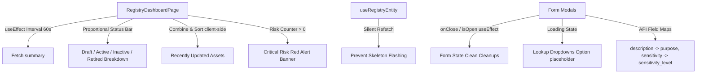

# Implementation Plan - Registry Dashboard, Defect Fixes & Navigation Polish

This plan outlines the enhancements and defect fixes for the Governance Registry. It builds on the core Phase 1 foundation to implement real-time summary status trackers, robust drop-down lookup states, precise API error input mappings, and navigation title/breadcrumb polishing.

---

## User Review Required

> [!NOTE]
> **Real-Time Active Counts Integration**: We are replacing the hard-coded percentages in the dashboard's status bars with real, aggregated results fetched from the database summary endpoints.
>
> **Silent Refetch Optimization**: To avoid screen flashing and make row status badge changes smooth, we will optimize `useRegistryEntity` to perform background updates silently (avoiding setting `isLoading = true` if the cache is already populated).

---

## Proposed Changes



---

### 1. Task A — Dashboard Live Counts

#### [MODIFY] [RegistryDashboardPage.tsx](file:///c:/Users/aayus/Desktop/GuardianIQ--1/frontend/src/pages/RegistryDashboardPage.tsx)
* **Real Summary & Interval**:
  * Set up a `setInterval` triggering `getRegistrySummary()` every 60 seconds.
  * Integrate standard interval cleanup: `return () => clearInterval(intervalId)` on unmount.
  * Read actual counts dynamically (`summary.models?.total`, `summary.agents?.total`, etc.).
* **Proportional CSS status bars**:
  * Parse status groupings (`ACTIVE`, `DRAFT`, `INACTIVE`, `RETIRED`) from `by_status` payload block.
  * Render segments proportionally (only for categories with status fields; hide or skip on Users/Departments).
* **Critical Risk Alert Banner**:
  * Calculate combined count of Models and Agents with `risk_level === "CRITICAL"`.
  * If greater than 0, inject a high-priority, pulsing red glassmorphic alert banner at the top of the dashboard.
* **Recently Updated Section**:
  * Call `listModels({ sort_by: "updated_at", sort_dir: "desc", per_page: 3 })` and `listAgents({ sort_by: "updated_at", sort_dir: "desc", per_page: 3 })` on mount.
  * Combine lists in frontend, sort by `updated_at` descending, and map to a feed list with custom `MODEL`/`AGENT` badges and a relative `"time ago"` calculator.

---

### 2. Task B — Defect Fixes

#### [MODIFY] [useRegistryEntity.ts](file:///c:/Users/aayus/Desktop/GuardianIQ--1/frontend/src/hooks/useRegistryEntity.ts)
* Implement a `useRef` to track `initialFetchRef`. If it is `false` (subsequent refetches), skip `setIsLoading(true)` to allow silent background data updates without rendering skeleton loaders and causing screen flashes.

#### [MODIFY] [Table.tsx](file:///c:/Users/aayus/Desktop/GuardianIQ--1/frontend/src/components/common/Table.tsx)
* Change the TS type signature of `header` from `string` to `React.ReactNode` to correctly support JSX sorting arrows cleanly:
```typescript
export interface Column<T> {
  key: string;
  header: React.ReactNode;
  render?: (row: T) => React.ReactNode;
}
```

#### [MODIFY] Modals Lookup Loading Dropdowns
* Update all Modals (`ModelFormModal.tsx`, `AgentFormModal.tsx`, `ToolFormModal.tsx`, `WorkflowFormModal.tsx`, `DataSourceFormModal.tsx`, `DepartmentFormModal.tsx`, `UserFormModal.tsx`):
  * Introduce loading lookups states (e.g. `loadingLookups` / `loadingUsers`).
  * Display a friendly loading text `<option value="">Loading lookup list...</option>` while lookups load.
  * Clear general errors and reset states inside `useEffect` watching `isOpen`.

#### [MODIFY] API Validation Error Inputs Mapping
* Update the `handleApiError` inside modals:
  * Map `description` to `purpose` and `model_version` to `version` in `ModelFormModal.tsx`.
  * Map `sensitivity` to `sensitivity_level` in `DataSourceFormModal.tsx`.
  * Clean up and verify input elements.

---

### 3. Task C — Modal Wiring Verification
* Perform a double-check on `ToolFormModal.tsx`, `WorkflowFormModal.tsx`, `DataSourceFormModal.tsx`, and `DepartmentFormModal.tsx` to verify they contain active tab wiring for Details, Relationships, and Audit Trail.

---

### 4. Task D — Navigation Polish

#### [MODIFY] Page Titles and Breadcrumbs
* In each of the 8 registry pages, add a `useEffect` setting `document.title` on mount:
  * E.g. `document.title = "AI Models — GuardianIQ Registry";`
* Render a simple text breadcrumb `Registry > [Page Name]` at the top of each sub-page, styled using localized `.breadcrumb` CSS rules.

---

## Verification Plan

### Automated Tests
* Execute compilation builds to verify total system type safety:
  ```bash
  npm run build
  ```

### Manual Verification
1. **Pristine Form States**: Open a modal, type fields, close it, and reopen it. Verify that the form starts 100% empty and fresh.
2. **Dashboard Auto-Refresh**: Let the dashboard run for 60 seconds, check logs to confirm the summary endpoint triggers, and observe the recently updated timeline.
3. **Lookup dropdown loading**: Simulate list lookups loading and verify option displays.
4. **Navigation**: Verify page document titles and check that breadcrumbs match the active page exactly.
